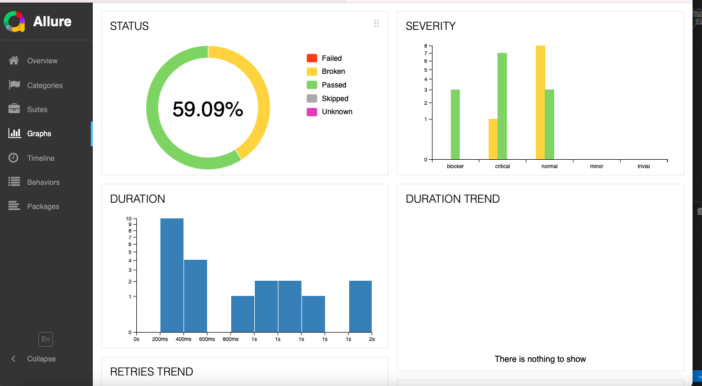
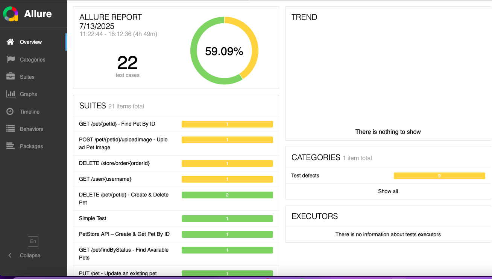

```markdown
# TechCareer Otomasyon Süreçleri Bootcamp'i

Bu proje, TechCareer Otomasyon Süreçleri Bootcamp'i kapsamında, Swagger PetStore API'sindeki temel uç noktalar için  Cypress ve Allure raporlama entegrasyonu ile testler içerir. 

---

## 🚀 Özellikler

- **Bootcamp Seviyesinde API Testleri**: Pet, User ve Store uç noktaları için temel CRUD ve senaryo doğrulama.
- ** Jenkins ile CI/CD deneyimi planlıyorum.

## API Uç Noktaları

### Pet API Endpoints
- `POST /pet` : Yeni evcil hayvan oluşturma
- `GET /pet/{petId}` : ID ile evcil hayvan bilgilerini alma
- `PUT /pet` : Mevcut evcil hayvanı güncelleme
- `DELETE /pet/{petId}` : ID ile evcil hayvan silme
- `GET /pet/findByStatus` : Duruma göre evcil hayvanları listeleme
- `POST /pet/{petId}/uploadImage` : Resim yükleme

### User API Endpoints
- `POST /user` : Yeni kullanıcı oluşturma
- `GET /user/{username}` : Kullanıcı bilgisi alma
- `PUT /user/{username}` : Kullanıcı güncelleme
- `DELETE /user/{username}` : Kullanıcı silme
- `GET /user/login` : Giriş
- `GET /user/logout` : Çıkış

### Store API Endpoints
- `POST /store/order` : Sipariş oluşturma
- `GET /store/order/{orderId}` : Sipariş sorgulama
- `DELETE /store/order/{orderId}` : Sipariş silme
- `GET /store/inventory` : Envanter durumu sorgulama

## Allure Ekran Görüntüleri


---

# TechCareer Automation Processes Bootcamp

This project is part of the TechCareer Automation Processes Bootcamp. It contains  Cypress tests with Allure reporting for Swagger PetStore API endpoints. 

## 🚀 Features

- Basic CRUD scenarios for Pet, User, and Store endpoints.
- ** Jenkins CI/CD setup.

## API Endpoints

### Pet API Endpoints
- `POST /pet` : Create a new pet
- `GET /pet/{petId}` : Retrieve pet by ID
- `PUT /pet` : Update an existing pet
- `DELETE /pet/{petId}` : Delete a pet by ID
- `GET /pet/findByStatus` : List pets by status
- `POST /pet/{petId}/uploadImage` : Upload pet image

### User API Endpoints
- `POST /user` : Create a new user
- `GET /user/{username}` : Get user by username
- `PUT /user/{username}` : Update user by username
- `DELETE /user/{username}` : Delete user by username
- `GET /user/login` : User login
- `GET /user/logout` : User logout

### Store API Endpoints
- `POST /store/order` : Place an order
- `GET /store/order/{orderId}` : Get order by ID
- `DELETE /store/order/{orderId}` : Delete order by ID
- `GET /store/inventory` : Get inventory by status

## Allure Screenshots




```
